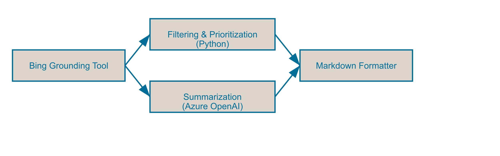

# AI News Agent

**Agent Name:** AI News Agent

AI News is an intelligent information summarization agent designed to help executives and decision-makers stay on top of the rapidly evolving world of artificial intelligence. By continuously scanning credible news sources, it identifies and summarizes the most impactful AI developments—especially those relevant to the Microsoft ecosystem, healthcare, and construction industries.

The agent reduces information overload by prioritizing high-value updates and presenting them in a clear, digestible Markdown table format. Each summary includes a headline, date, key insight, strategic implications, and a verified source link.

AI News is not a replacement for human analysis or legal due diligence. Instead, it augments executive awareness by surfacing credible developments that may require further attention or discussion. All strategic decisions and compliance assessments remain the responsibility of the end user.


## 🎯 Use Cases

1. **Daily Team Briefing:** Generate a morning digest of AI developments for Microsoft product teams.
2. **Industry Watch:** Provide Healthcare or Legal compliance teams with up-to-the-minute AI news.
3. **Executive Snapshot:** Deliver a concise AI highlights report to executives.

## 🔍 What It Does

- Searches Bing News via the BingGroundedSearchTool for the latest AI developments (last 24 hours PT)
- Filters by publication date and credible domains (e.g., gartner.com, reuters.com, wired.com, mit.edu, stanford.edu)
- Prioritizes items in this order: Microsoft+Healthcare → Microsoft+Legal → Healthcare → Legal
- Summarizes each development and outlines implications for the three focus areas
- Outputs in a Markdown table with columns: Headline, Date, Summary, Implications, Link

## 🧠 Agent Instructions

The agent follows a system prompt that enforces:
- Source filtering against a predefined list of credible domains
- Publication date constraint within the 24‑hour window
- Priority order for topic groups
- Consistent Markdown formatting for the output table

## 🛠 Tools

### BingGroundedSearchTool
- **Description:** Queries Bing News for AI-related articles
- **Auth:** Configured via `BING_SEARCH_KEY` environment variable (e.g., stored in Azure Key Vault)
- **Reference:** OpenAPI schema provided in `tools/bing-grounded-search-schema.yaml`

## 🧪 Sample Prompts

- "What are the most impactful AI developments for Microsoft in the last 24 hours?"
- "Summarize recent legal sector AI news."
- "Healthcare-related AI breakthroughs today?"

## Architecture Overview
This agent uses Azure AI Projects with the BingGroundedSearchTool to query Bing News, applies filtering and prioritization logic in Python, summarizes via Azure OpenAI, and formats output as Markdown.  


## 📁 Example Notebook

Refer to [`agent-ai-news.ipynb`](./agent-ai-news.ipynb) for a guided walkthrough.

## Setup Instructions

1. Clone the repository:
   ```bash
   git clone https://github.com/your-org/azure-ai-agent-service-blueprints.git
   cd azure-ai-agent-service-blueprints/ai-developments-aggregation-agent
   ```
2. Create and activate a virtual environment:
   ```bash
   python3 -m venv .venv
   source .venv/bin/activate
   ```
3. Install dependencies:
   ```bash
   pip install -r requirements.txt
   ```
4. Set required environment variables:
   ```bash
   export AZURE_OPENAI_ENDPOINT="https://<your-endpoint>.openai.azure.com/"
   export AZURE_OPENAI_KEY="<your-openai-key>"
   export BING_SEARCH_KEY="<your-bing-key>"
   ```
5. (Optional) Review and modify configuration in `template.py`.

### Configuration Guide

| Parameter                | Description                                                                                                         |
|--------------------------|---------------------------------------------------------------------------------------------------------------------|
| `TIME_LOOKBACK_HOURS`    | Number of hours to look back (default 24)                                                                            |
| `MAX_ITEMS`              | Maximum number of developments to return (default 10)                                                                |
| `PRIORITY_ORDER`         | Topic priority list (default `["Microsoft+Healthcare","Microsoft+Legal","Healthcare","Legal"]`)                      |
| `CREDIBLE_SOURCES`       | List of domains to consider (default `["gartner.com", "reuters.com", "wired.com", "mit.edu", "stanford.edu", "berkeley.edu", "washington.edu", "ox.ac.uk", "cam.ac.uk", "ethz.ch", "mpg.de", "csail.mit.edu", "isi.edu", "deepmind.com", "openai.com", "research.google", "ai.facebook.com", "microsoft.com/en-us/research", "nvidia.com/research", "ieee.org", "ieeexplore.ieee.org", "jair.org", "neuralnetworksjournal.com", "sciencedaily.com", "technologyreview.com", "wired.com", "theverge.com", "techcrunch.com", "analyticsinsight.net", "aimagazine.com", "aitrends.com", "aichief.com", "techtarget.com"]`)            |

### Sample Data

- No input data is required; the agent runs on schedule and logs or prints the output.

### Example Agent Interaction

```text
User: What are today’s top AI developments for Microsoft and healthcare?
Agent: | Headline | Date | Summary | Implications | Link |
      |—————|———|———|——————|—|
      | ...    | ... | ...     | ...          | ...  |

User: Summarize the latest legal AI news.
Agent: | Headline | Date | Summary | Implications | Link | ... |

User: Run the AI Developments Aggregation Agent now.
Agent: (returns a Markdown table of up to 10 items)
```

### Customization Tips

- To adjust focus areas or add new topics, update `PRIORITY_ORDER` in `template.py`.
- To route output to other targets (e.g., email, Teams), wrap the final table in a notification action.
- To change the timezone from Pacific, review the # Compute time window (Pacific) section and make the necessary adjustments

## 🖼 Company Logo

[Logo](./your-logo.svg)

## Company
Marquee Insights is a specialized AI consultancy delivering cutting-edge solutions. Visit [Marquee Insights](https://marqueeinsights.com).

## Support
For support, contact hello@marqueeinsights.com

## License

MIT License
